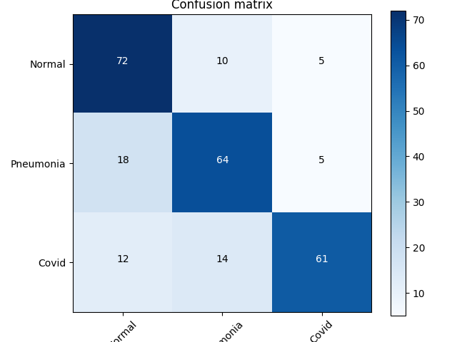
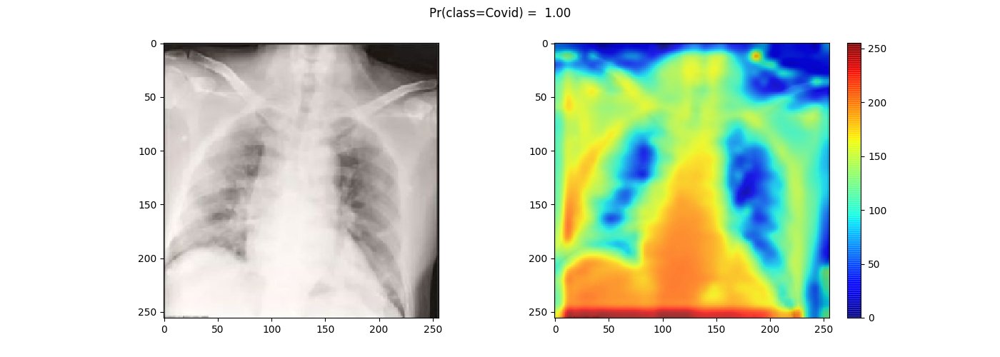
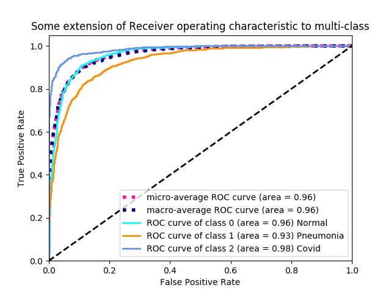

# Covid19Detection
In this project I want to show the results about detections COVID19 through X-Ray Images using a DeepLearning approach. 
Although the data available are still scarce, I have tried to create a machine learning model through a neural network ResNet50. This model was made by myself so I didnt use pretrained models available.


 ### Model Description
The model is a Convolutional Neural Network with shortcuts as showed in this paper: https://arxiv.org/pdf/1512.03385.pdf

### Libraries
My ResNet50 model was developed with the Python programming language and the following libraries:
 - Keras 2.3
 - TensorFlow 2.0
 - Python 3.6
 - Matplotlib
 
### Dataset
For this project I've used this dataset: https://github.com/haydengunraj/COVIDNet-CT/blob/master/docs/dataset.md. 
1. Train (462 images for each)
   1. Normal: 
   1. Covid
   1. Pneumonia

1. Test (198 images for each)
   1. Normal
   1. Covid
   1. Pneumonia
 

<!--
I used dataset at the following link: https://github.com/ieee8023/covid-chestxray-dataset
This dataset is the best known at the moment as regards the chest X-ray images from Covid19. In particular, attention is paid to the repository is currently still "working in progress". That's means it's always in updating mode.
The dataset made available by the author pays attention to Pneumonia diseases since COVID19 is a virus that attacks the lungs causing Pneumonia.
So the dataset mainly provides a subdivision between: Pneumonia cases (MERS, SARS, and ARDS) and COVID19. 2 classes.
I opted to add more data to my dataset both in train and in test in order to achieve much performance and to reach 70% for training and 30% for testing in case of Pneumonia class. 
In this work it was used a third class. In this case I have used class "normal" to indentify a good status of healthy.
The added class "Normal" and the additional data for penumonia cases are available at the follow link:
https://www.kaggle.com/paultimothymooney/detecting-pneumonia-in-x-ray-images
The images between the two datasets are both X-RAY.
-->

### Goal:
The goal proposed in this paper is to detect Covid and Non-Covid diseases.
Therefore I will try to make the model as accurate as possible. 

### How to use:
As you can see the dataset is composed by several data taken from web. (This practice has also been widely used by various authors in the realization of the same papers about Covid with deep NN). 
Before to train you model you have to set path for dataset. It is advisable to upload images only once and store them in an array (in our case you can find array in "data" folder).

To train run: 
```sh
$ python resnet4.py
```

### Hyperparameter
For the training the following hyperparameters are used: 
- AdamOptimization in schedule
- 70 Epochs
- BatchSize 16
- Last layer a softmax is used
- Loss function Cross Entropy Categorical is used 
- Learning rate in schedule from 0.001
- BatchNorm 


### Results:
- Accuracy: 0.99
- Val Accuracy: 0.95
- Val Loss: 0.94

Results | #Precision | #Recall | #f1-score | #support 
--- | --- | --- | --- |--- 
Normal | 0.97 | 0.95 | 0.96 | 213 
Pneumonia | 0.96 | 0.93 | 0.94 | 218 
COVID19 | 0.96 | 1.0 | 0.98 | 219









### Conclusion
My goal is always to increase the dataset of images from COVID and to take care of the accuracy of my model.
Through the confusion matrix it has been possible to observe that COVID images are often confused by the Pneumonia class which includes various pneumonia diseases. This "Miss classification" phenomenon is caused by the fact that COVID manifests itself as a form of Pneumonia just like the data in "Pneumonia".

### Contact
My contact is: luigi.russo@studenti.uniparthenope.it


